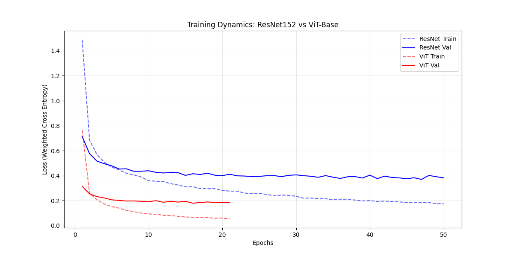

# 🌱 Cat-Safe Plant Classifier 🐱

A deep learning system that identifies 47 houseplant species and warns cat owners about their toxicity. Built as part of a Bachelor's thesis on computer vision for pet safety.

## 🔗 Quick Links

- **[Live Demo](https://huggingface.co/spaces/kakasher/Cat-Safe-Plant-Classfier)** – Try it on HuggingFace Spaces
- **[Kaggle Walkthrough](https://www.kaggle.com/code/kacpergregorowicz/cat-safe-plant-classifier-walkthrough)** – Step-by-step tutorial
- **[Visualize Model](https://netron.app/?url=https://huggingface.co/kakasher/cat-safe-plant-classifier-vitb16-224/resolve/main/plant-classifier-vitb32.onnx)** – View architecture on Netron

## 📊 Dataset

| Metric | Value |
|--------|-------|
| Total Images | 14,774 |
| Classes | 47 plant species |
| Train/Test Split | 11,819 / 2,955 (80/20) |
| Largest Class | Monstera Deliciosa (547) |
| Smallest Class | Yucca (66) |

Images were web-scraped from Bing, cleaned with [fastdup](https://github.com/visual-layer/fastdup), and manually curated.

**Download:** [Kaggle Dataset](https://www.kaggle.com/datasets/kacpergregorowicz/house-plant-species)

> **Note:** Dataset is for personal/educational use only due to copyright considerations.

## 🏆 Best Results (Vision Transformer)

| Metric | Score |
|--------|-------|
| Balanced Accuracy | 94.65% |
| Weighted F1 | 94.70% |
| Top-3 Accuracy | 99.06% |

**Config:** `vit_base_patch16_224` • 50 epochs (early stopping) • lr=0.001 • batch=128 • AdamW • weighted loss



## 🛠️ Project Structure

```
plants-toxic-for-cats/
├── src/
│   ├── data/           # Scraping, cleaning, splitting scripts
│   ├── models/         # Training, model setup, metrics
│   └── gradio_app/     # Web interface + toxicity database
├── notebooks/          # EDA and experiments
├── data/               # Raw images (47 species folders)
│   └── train_test/     # Stratified split
└── models/             # Saved weights and plots
```

## 🚀 Usage

### Training
```bash
cd src/models
python main.py --model_name vit_b16_224 --epochs 50 --batch_size 128 --lr 0.001
```

### Run Web App
```bash
cd src/gradio_app
python app.py
```

## 🔬 Technical Approach

1. **Transfer Learning** – Fine-tuned from [Pl@ntNet-300K](https://github.com/plantnet/PlantNet-300K) weights
2. **Frozen Backbone** – Only classification head trained (feature extraction)
3. **Class Imbalance** – Handled via weighted CrossEntropyLoss
4. **Augmentation** – HorizontalFlip, ColorJitter, ShiftScaleRotate (Albumentations)
5. **Open-Set Rejection** – 60% confidence threshold rejects unknown inputs

## 📚 Key References

- He et al. (2016) – [Deep Residual Learning](https://arxiv.org/abs/1512.03385)
- Dosovitskiy et al. (2020) – [Vision Transformer](https://arxiv.org/abs/2010.11929)
- Garcin et al. (2021) – [Pl@ntNet-300K Dataset](https://arxiv.org/abs/2306.01234)
- Khan et al. (2017) – [Cost-Sensitive Learning](https://ieeexplore.ieee.org/document/7854196)

## 🙏 Acknowledgements

- [Pl@ntNet](https://github.com/plantnet/PlantNet-300K) for pre-trained weights
- [ASPCA Animal Poison Control](https://www.aspca.org/pet-care/animal-poison-control) for toxicity data
- [timm](https://github.com/huggingface/pytorch-image-models) for model implementations

## 📄 License

This project was developed for academic purposes as part of a Bachelor's thesis.
